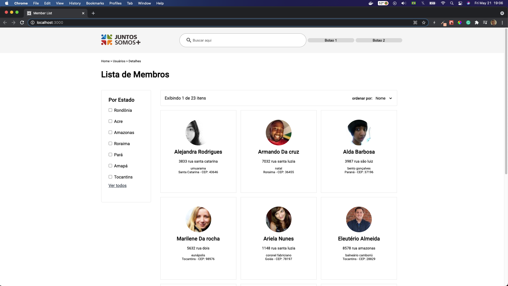

<span align="center">
  
</span>

# Technical Assesment for Opened Position in JuntosSomos+

[](https://github.com/thomaslnx)
[](https://www.linkedin.com/in/marcos-de-moura-silva/)

<br/>
<br/>

<hr/>

<span align="center">
  
</span>

# :memo: Description

<p>The present project consists of a technical assessment for a web development opened position on JuntosSomos+. A company as defined by them it self:
<br> <br>
<pre>Quem somos
Somos a maior rede de relacionamento do mercado de construção civil. Trabalhamos duro para unir empresas líderes do setor e conectá-las aos lojistas e profissionais de obra.
&nbsp;
Promovemos diversos benefícios exclusivos e mais desenvolvimento para quem coloca a mão na massa e ajuda a construir um Brasil melhor. </pre>
</p>

# ⚙️ Applied Libraries and Technologies

- ReactJS;
- Axios;
- Styled-Components;
- ESlint;
- Prettier;
- JSON-Server;
- Backend NodeJS for serving fake API data using JSON-Server;


# Note from Author:
```in this project were used too few libraries and this was intentional because I was wanna show that I have some good domain from the main language used and framework e such domain turn more ease the use of ready tools. I hope you appreciate my work and effort in accomplish the final result. In case of doubt please do contact me and I'll pleasure to answer any questions about the project.```

Made with :heartbeat: by [Marcos Moura](https://github.com/thomaslnx)
